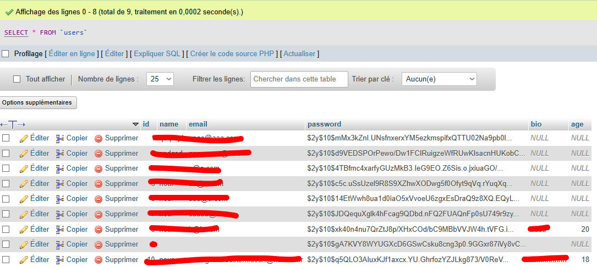

# 🎵 MusicalLife - Plateforme Sociale pour Musiciens

 
 
 
 


Une application web permettant aux musiciens de se connecter, collaborer et partager leur univers musical.

## ✨ Fonctionnalités
- **Authentification**
  - Système sécurisé JWT (connexion/inscription)
  - Profils personnalisables (age, nom, bio)
- **Messagerie Instantanée**
  - Chat en temps réel
  - Historique des conversations

- **Découverte**
  - Recherche de musiciens 
  

## 🛠 Technologies
**Frontend**
- React 18 + Vite
- Tailwind CSS
- Axios
- React Icons

**Backend**
- PHP 8+
- MySQL
- API REST

## 🚀 Installation
1. Cloner le dépôt :
```bash
git clone https://github.com/votreusername/MusicalLife.git .


# Configurer le frontend :

cd client
npm install
npm run dev


# Configurer le backend :

Importer database.sql dans MySQL

Configurer .env :

DB_HOST=localhost
DB_NAME=musicallife
DB_USER=root
DB_PASS=
JWT_SECRET=votre_clé_secrète

## 📜 Structure des Fichiers

MusicaalLife/
├── frontend/          # Frontend React
│   ├── src/
│   │   ├── components/
│   │   ├── pages/
│   │   └── App.jsx
├── api/          # Backend PHP
│   ├── auth.php
│   ├── messages.php
│   └── .htaccess
├
└── README.md

## figma : https://www.figma.com/design/9R8DXXROmTvvY5sE24uY1z/Untitled?node-id=3-113&p=f


